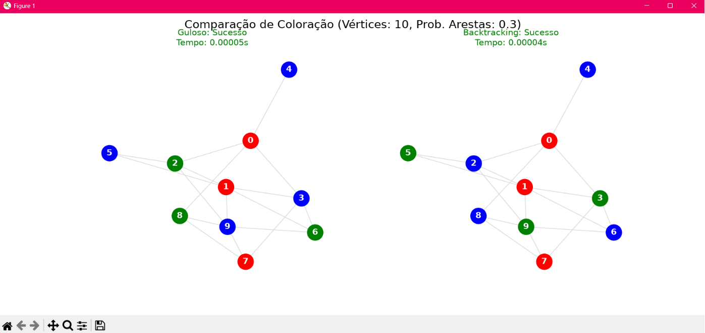

# Análise Comparativa do Problema da 3-Coloração: Guloso vs. Backtracking
Este repositório contém um simulador interativo em Python desenvolvido como projeto prático para a disciplina de **Projeto e Análise de Algoritmos (PAA)** da **UFRPE**, sob a orientação da **Profª. Jeane**. 

O objetivo do software é analisar e comparar o desempenho dos algoritmos **Guloso** (Coloração Sequencial) e **Backtracking** na resolução do **Problema da 3-Coloração**. Utilizando as bibliotecas `NetworkX` e `Matplotlib` sob o modelo de grafos aleatórios de Erdos-Renyi, o simulador avalia a eficiência, o tempo de execução e o limite de falhas de ambas as estratégias conforme a densidade das arestas varia em instâncias com o número de vértices definido pelo usuário.

---

##  Pré-requisitos

Antes de rodar o programa, certifique-se de ter as seguintes bibliotecas instaladas no seu ambiente Python:

```bash
pip install networkx matplotlib
```
## Como Executar no VS Code

> Você pode rodar o simulador diretamente pela interface do editor 

> Abra a pasta do projeto no VS Code.

> Clique no menu superior Run e selecione Run Without Debugging (ou use o atalho Ctrl + F5).

> No terminal integrado que abrir na parte inferior, insira os dados solicitados (como a probabilidade de conexão de arestas) e pressione Enter para acompanhar os resultados e a geração dos gráficos.

## Geração de grafos


